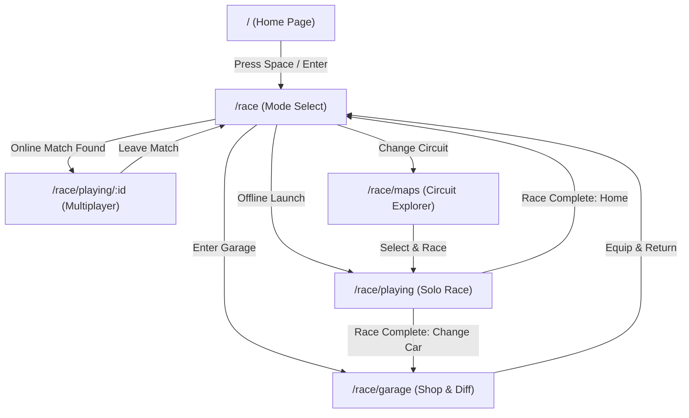

# Routing & Pagination Architecture Guide

**Project**: TYVORA-RACING  
**Router**: `react-router-dom` v7+  
**Architecture**: Atomic Client-Side Routing with Route-Guarded Subviews  

---

## 1. Route Hierarchy

| Route Path | Screen Component | Purpose & Features |
|---|---|---|
| `/` or `/home` | [`HomeScreen`](file:///home/sky/Work/gamevibe/carstyping/apps/web/src/components/screens/HomeScreen.tsx) | Cinematic WebGL canvas background, lower-third telemetry pod (live oscillation speedometer + top racer standing), hotkey launch (`Enter` / `Space`) to `/race`. |
| `/race` | [`RaceModeSelectScreen`](file:///home/sky/Work/gamevibe/carstyping/apps/web/src/components/screens/RaceModeSelectScreen.tsx) | Race control hub: Solo offline paddock setup (bots 1–4, difficulty easy/mid/hard, circuit picker), online matchmaking search, equipped vehicle preview, quick access to garage. |
| `/race/garage` | [`GarageScreen`](file:///home/sky/Work/gamevibe/carstyping/apps/web/src/components/screens/GarageScreen.tsx) | 3D vehicle showroom turntable, side-by-side spec comparison ("choose diff and buy"), custom metallic livery paint studio, explicit car purchasing with driver points via SQLite WASM. |
| `/race/maps` | [`MapsScreen`](file:///home/sky/Work/gamevibe/carstyping/apps/web/src/components/screens/MapsScreen.tsx) | Circuit explorer: Inspect all 6 scenic circuits (Pacific Coast, Alpine Pass, Tokyo Bay, Red Rock, Monaco Marina, Sakura Valley) with weather, terrain, spline curves, and direct launch. |
| `/race/playing` | [`RacePlayingScreen`](file:///home/sky/Work/gamevibe/carstyping/apps/web/src/components/screens/RacePlayingScreen.tsx) | Active offline race viewport: 3D track, player vehicle, AI bot ghost competitors, top progress bar, 5-word typing HUD, countdown, overtake notifications, multi-round heats, final results modal. |
| `/race/playing/:id` | [`RacePlayingScreen`](file:///home/sky/Work/gamevibe/carstyping/apps/web/src/components/screens/RacePlayingScreen.tsx) | Online multiplayer active race viewport: URL-parameterized lobby/room ID (`:id`), live telemetry, opponent standings, synchronized match timer. |
| `/leaderboard` | [`LeaderboardScreen`](file:///home/sky/Work/gamevibe/carstyping/apps/web/src/components/screens/LeaderboardScreen.tsx) | Global driver championship standings, top-3 podium inspection, user ranking, points ladder. |
| `/profile` | [`ProfileScreen`](file:///home/sky/Work/gamevibe/carstyping/apps/web/src/components/screens/ProfileScreen.tsx) | Career telemetry (WPM, accuracy, win rate, streaks), unlocked vehicle collection, SQLite binary and JSON backup exports, database reset. |
| `/settings` | [`SettingsScreen`](file:///home/sky/Work/gamevibe/carstyping/apps/web/src/components/screens/SettingsScreen.tsx) | Audio mixer (engine RPM, typing clacks, sound effects), graphics & motion accessibility, terms/privacy legal dialog. |
| `/landing` | [`LandingScreen`](file:///home/sky/Work/gamevibe/carstyping/apps/web/src/components/screens/LandingScreen.tsx) | Marketing showcase landing screen with interactive showroom turntable. |

---

## 2. Navigation Flow Diagram

---

## 3. WebGL Canvas & Context Lifecycle Management

To prevent WebGL context leaks and guarantee 60 FPS performance:
1. **Showroom Canvas** ([`ShowroomCanvas.tsx`](file:///home/sky/Work/gamevibe/carstyping/apps/web/src/components/scene/ShowroomCanvas.tsx)):
   - Used only on `/race/garage` and `/landing`.
   - Mounts orbital turntable lighting, geometry, and materials.
   - Cleanly unmounts Three.js scene and renders null when navigating to `/race/playing`.
2. **Race Canvas** ([`RaceCanvas.tsx`](file:///home/sky/Work/gamevibe/carstyping/apps/web/src/components/scene/RaceCanvas.tsx)):
   - Used only on `/race/playing` and `/race/playing/:id`.
   - Mounts procedural track world, player vehicle, AI ghosts, particle bursts, and camera rig.
   - Unmounts animation loop and engine frame listeners on unmount.
