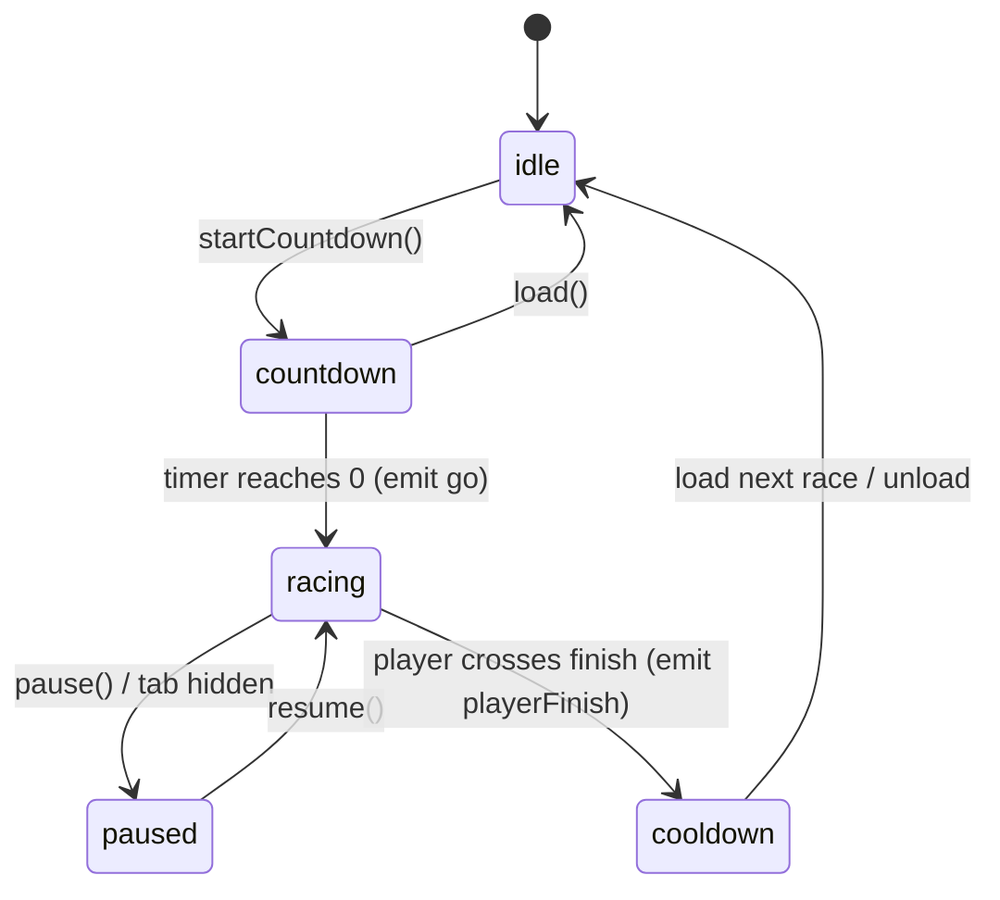

# 01 — Simulation

## 1. Fixed-step loop (`apps/web/src/engine/core/FixedStepLoop.ts`)

Classic "Fix Your Timestep" accumulator:

```text
frame(dtWall):
  dtWall      = min(dtWall, MAX_FRAME_MS = 250)      // tab switch / debugger guard
  accumulator += dtWall
  steps = 0
  while accumulator >= DT_MS and steps < MAX_STEPS (8):
      sim.snapshotPrev()        // curr -> prev (double buffer)
      sim.step(DT)              // DT = 1/120 s (TICK_HZ from packages/sim)
      accumulator -= DT_MS
      steps++
  if steps == MAX_STEPS: accumulator = min(accumulator, DT_MS)   // drop debt, never spiral
  alpha = accumulator / DT_MS   // 0..1, used by interpolation
```

* 120 Hz sim: 2 steps per 60 Hz frame, ~1 per 120 Hz frame, 0–1 per 144 Hz frame — interpolation
  makes all of them look identical.
* `reset()` on phase changes (GO, resume) so no time debt is carried across pauses.

## 2. Race clock & input timestamps (`core/RaceClock.ts`)

* `raceMs` = racing wall time elapsed (excludes countdown and pauses). Sim time ≤ `raceMs`
  (the difference is the accumulator).
* Keystrokes are timestamped with `gameEngine.nowRaceMs(e.timeStamp)`:
  `raceMsAtLastFrame + (e.timeStamp − lastFrameWall)`, clamped to `[0, +100 ms]`.
  `KeyboardEvent.timeStamp` shares `performance.now()`'s origin, so typing timing is precise to the
  event, not to the frame.
* Typing is processed **immediately** on keydown (instant text feedback + click audio). The physics
  reads the typing state at every fixed tick, and all physics math uses those timestamps, so results
  are deterministic for a given keystroke log.

## 3. Race simulation (`packages/sim/src/race.ts`)

Pure TypeScript, no DOM / three.js — shared with tests and (later) server-side replay validation.

```ts
interface RaceEntrant {
  racer: RacerSim;       // v, d, accel, lat, latV, stallUntilMs, finishMs
  typing: TypingState;   // player: live store state; AI: replayed script
  car: CarSpec;
  script: KeystrokeEntry[] | null;  // AI keystroke log (null = human)
  cursor: number;                   // index into script (no Array.shift())
  laneOffset: number;               // metres, + = right of centreline
  targetWpm: number;
}

class RaceSimulation {
  step(dtSec): void              // one fixed tick
  rankOf(i): number              // 1-based, by finish time then distance
  estimateFinishMs(i): number    // deterministic fast-forward on a clone
  finishedThisStep: number[]     // preallocated event buffer (count in finishedCount)
}
```

Per tick:

1. Replay AI script entries with `t ≤ tickEnd` (cursor advance, zero allocation).
2. Find the **nearest** opponent ahead of the player (previously: the overall leader) → slipstream.
3. `stepCar()` for every unfinished-or-cooling-down entrant.
4. Lateral dynamics (critically-damped spring per racer).
5. Finish detection with sub-tick interpolation; push to `finishedThisStep`.

## 4. Physics model changes (`packages/sim/src/physics.ts`)

| Change | Why |
| ------ | --- |
| **Progress coupling**: `vDes *= 1 + clamp((E − d)/60 m, −1, 1) · 0.25`, where `E = D · C / L` is the distance *earned* by correct characters | Track position now reflects typing progress, so ranks/overtakes are meaningful and fair, while speed still *feels* WPM-driven |
| **Hold-line braking curve** replaces the teleport clamp: when text is incomplete `v ≤ √(2 · 20 m/s² · (D − 2 − d))` | Car decelerates smoothly to the line instead of freezing with spinning wheels (A10) |
| **Post-finish run-out**: after crossing, `v ≤ √(2 · 10 m/s² · (D + 420 − d))` | Cars brake to a stop in the run-out while the round overlay is shown (A11) |
| Rubber-banding disabled once the player has finished | AI finish estimates stay consistent with what the player sees |
| **Lateral state** `lat`, `latV` on `RacerSim` | Slipstream drift toward the car ahead, mistake "twitch" impulse, overlap avoidance |

### Lateral dynamics (visual gameplay feedback, deterministic)

```text
target = 0                                         // own lane centre
if player drafting car j (gap 4..22 m):            // lean into the slipstream
    target = sign(lane_j − lane_self) · 1.4 m · draftStrength
if |d_self − d_j| < 1.25 · carLength:              // side-by-side → overlap avoidance
    target = 0                                     // never intrude into an occupied lane
latA = ω²·(target − lat) − 2ω·latV                 // critically damped, ω = 3.2 rad/s
on mistake: latV += ±0.9 m/s (alternating sign)    // visible twitch
```

Ghosts never collide (they are ghosts), but the player's drift is constrained so cars never
interpenetrate visually.

## 5. Phase state machine (`GameEngine.phase`)



* Countdown is timed by the render loop (emits `countdown(3|2|1)` and `go`) — synchronized with
  visuals, and the camera intro sweep is driven by the same timer.
* `cooldown`: sim keeps running (cars brake in the run-out, ghosts finish their run), input disabled.
* Store ⇄ engine: the store **commands** the engine (`load`, `startCountdown`, `pause`, `resume`);
  the engine **notifies** the store through the `EventBus` (`countdown`, `go`, `playerFinish`).

## 6. Results

At `playerFinish` the store computes standings: finished entrants use their real `finishMs`;
unfinished AIs use `estimateFinishMs()` — a deterministic fast-forward of a cloned entrant with the
same physics, so the result matches what plays out on screen during cooldown.
