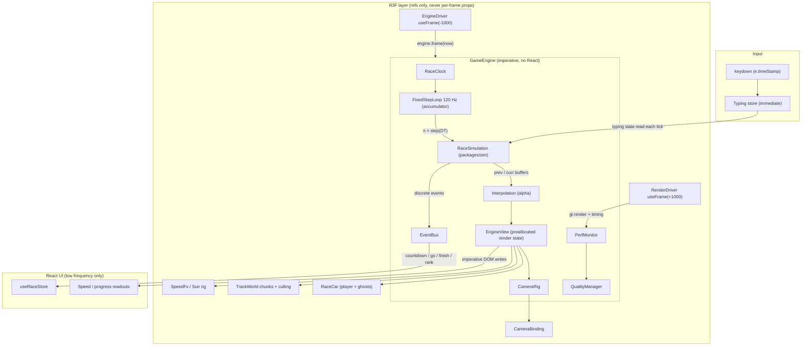

# TYVORA Race Engine — Plan & Architecture

> Goal: not "make the cars move", but a proper
> **simulation → interpolation → rendering** pipeline so every race runs at a
> locked 60 FPS, feels responsive, and stays visually stable.

| Doc | Contents |
| --- | --- |
| [01-simulation.md](./01-simulation.md) | Fixed-step loop, race simulation, physics model, input timing, phases |
| [02-interpolation-rendering.md](./02-interpolation-rendering.md) | Double-buffered state, interpolation, track path, world batching & culling, R3F layer |
| [03-camera-visual-fx.md](./03-camera-visual-fx.md) | Camera rig, car animation, ghosts, shadows, particles, transitions |
| [04-performance.md](./04-performance.md) | Frame budget, hot-loop rules, perf monitor, adaptive quality tiers |
| [05-roadmap.md](./05-roadmap.md) | Phased delivery plan, acceptance criteria, status |

---

## 1. Audit of the previous pipeline (why it was not 60 FPS clean)

| # | Problem | Where | Effect |
| - | ------- | ----- | ------ |
| A1 | `tickRace` did `set({ playerSim: {...}, opponents: [...] })` **every rAF** | `useRaceStore.ts` | Every subscriber re-rendered at 60 Hz: `RaceCanvas`, `RaceScreen`, `TypingHUD`, `RaceProgressBar` |
| A2 | `RaceCanvas` re-render reconciled `TrackMesh` (not memoized) | `RaceCanvas.tsx` | React diffed **~3,000 JSX meshes** per frame |
| A3 | Every curb / guardrail / tree part was its own mesh with its own geometry + material | `TrackMesh.tsx` | ~3,000 draw calls; thousands of GPU buffers |
| A4 | Ghost car re-cloned the full GLTF scene + new materials whenever `proximityBoost` changed (≈ every frame) | `GhostVehicle3D.tsx` | Per-frame scene clone, material churn, GC spikes |
| A5 | Simulation ran at variable `deltaMs` from rAF (not fixed step), no interpolation | `RaceScreen.tsx` | Frame-rate dependent physics, micro-stutter on 120/144 Hz displays |
| A6 | Camera used `lerp(current, desired, 1-exp(-k·dt))` on **position** | `PlayerFollowCamera.tsx` | Steady-state lag ≈ `v/k` ≈ 9 m at 300 km/h → visible delay that changes with speed |
| A7 | Sim distance `d` mapped to curve param `u = d / distance`, but the curve is ~12 % longer and uses a 200-division arc-length table | `TrackMesh.tsx` | Visual speed ≠ sim speed, non-uniform motion along the curve |
| A8 | Car body roll derived from finite-differencing `rotation` props per frame | `Vehicle3D.tsx` | Noisy, frame-rate dependent roll |
| A9 | Directional shadow camera fixed at the start line (±30 m) | `RaceCanvas.tsx` | Shadows disappear once the car leaves the start area |
| A10 | Car hard-clamped to `finish − 2 m` (v reset to 25 m/s) when text incomplete | `physics.ts` | Car teleport-freezes with wheels spinning |
| A11 | Sim stopped on finish (status ≠ racing) | `useRaceStore.ts` | Frozen world behind the round-complete overlay |
| A12 | Opponent lanes at ±3.4 m but lane markings at ±3.6 m | `RaceCanvas.tsx` / `TrackMesh.tsx` | Ghosts drive on the dashed lines |
| A13 | `opp.log.shift()` per AI keystroke; per-frame `new THREE.Vector3` in `useMemo` deps; `emissive.set('#hex')` per frame | various | Avoidable allocations in the hot loop |
| A14 | Countdown driven by `setInterval`, independent of the render loop; "GO!" never visible | `useRaceStore.ts` | Countdown not synchronized with visuals |
| A15 | No FPS / frame-time instrumentation, no quality scaling | — | No way to verify or protect the 16.67 ms budget |

---

## 2. Target architecture

### One frame (≈ 16.67 ms budget)

1. `EngineDriver` (R3F `useFrame`, priority −1000) → `gameEngine.frame(performance.now())`
2. Clamp wall `dt` (max 250 ms), feed the accumulator, run `n` fixed sim steps at 120 Hz
   (max 8 per frame — spiral-of-death guard). Before each step, copy `curr → prev`.
3. `alpha = accumulator / DT`; interpolate every racer `prev → curr`.
4. Sample the arc-length `TrackPath` (O(1), allocation-free) → world pose, yaw, slope, curvature.
5. Update spring-damped visual state (suspension, wheel spin, brake lights, ghost fade).
6. Update `CameraRig` from the **interpolated** player pose.
7. Notify imperative frame listeners (HUD text, progress bar, audio RPM at 30 Hz).
8. R3F components (priority 0) copy `EngineView` values into `Object3D`s.
9. `RenderDriver` (priority +1000) calls `gl.render` and records CPU frame cost.

### Ownership rules

| Data | Owner | Update rate | Consumers |
| ---- | ----- | ----------- | --------- |
| Match flow (status, round, results, car/track selection) | `useRaceStore` (zustand) | event-driven | React UI |
| Live sim (`RacerSim`, AI scripts, sim time) | `RaceSimulation` inside `GameEngine` | 120 Hz fixed | engine only |
| Render state (poses, springs, camera) | `EngineView` | per rAF | R3F refs, HUD refs |
| Typing state | `useTypingStore` | per keystroke | typing UI + sim (read) |
| Quality tier | `QualityManager` | rare (event) | R3F bindings |

**Never** drive per-frame values through React state or zustand `set`.

---

## 3. Engineering rules (enforced in review)

1. **No React state for anything that changes per frame.** Use `useFrame` + refs or `gameEngine.onFrame`.
2. **No allocations in the hot loop**: no `new`, no array/object literals, no closures, no string building
   per frame. Reuse module-level scratch objects; write into `out` parameters.
3. **Simulation is deterministic and fixed-step.** Same inputs + same timestamps ⇒ same race,
   regardless of display refresh rate or frame pacing.
4. **Render code never mutates the simulation.** Data flows sim → view → render.
5. **Static world is built once per race** (merged, chunked geometry) and disposed on unload.
6. **Every expensive effect has a quality knob** owned by `QualityManager`.
7. **Measure, don't guess**: perf overlay (F3 / `?perf`) in development, adaptive tiers in production.
